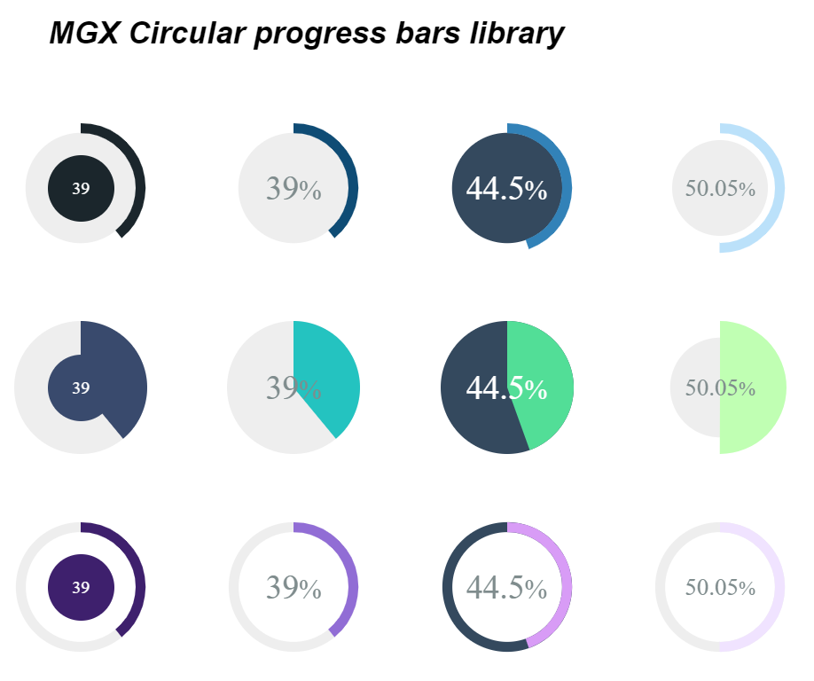

# MgxCircularProgressBar

## Description:
  
 A library for circular progress bars components, an elegant way to rappresent your percentages.

### **Demo**
this [Demo](https://stackblitz.com/edit/angular-79qrgc) has different combinations of progress bars, choose your favorite one!



## Development server

Run `ng serve` for a dev server. Navigate to `http://localhost:4200/`. The app will automatically reload if you change any of the source files.
      
## Installation:
 ```
   npm install mgx-circular-progress-bar --save
```

## Import and usage
include mgx-circular-progress module in your project, for example if you want to add it to your app module:
#### App Module

```js
import { BrowserModule } from '@angular/platform-browser';
import { AppComponent } from './app.component';
import { MgxCircularProgressModule } from 'mgx-circular-progress-bar';
//or in alternative
import { MgxCircularProgressBarModule, 
MgxCircularProgressFullBarModule, 
MgxCircularProgressPieModule } from'mgx-circular-progress-bar';

@NgModule({
  declarations: [
    AppComponent
  ],
  imports: [
    BrowserModule,
    MgxCircularProgressModule
    //or in alternative
    MgxCircularProgressBarModule,
    MgxCircularProgressFullBarModule,
    MgxCircularProgressPieModule 
  ],
  providers: [],
  bootstrap: [AppComponent]
})
export class AppModule { }
```

### Basic usage:
#### mgx-circular-progress-bar
```html
 <mgx-circular-progress-bar percentage="20"></mgx-circular-progress-bar>
```
#### mgx-circular-progress-full-bar
```html
 <mgx-circular-progress-full-bar percentage="20"></mgx-circular-progress-full-bar>
```
#### mgx-circular-progress-pie

```html
 <mgx-circular-progress-pie percentage="20"></mgx-circular-progress-pie>
```
  
  ### Main configurations

attribute | value expected | meaning
------------ | ------------- | -------------
percentage | from 0 to 100| percentage already calculated
total | any number | in combination with **barValue** calculate the percentage, must be >= than **barValue**
barValue | any number | is the value of the progress bar, the percentage is calculated in relation to the **total**, must be <= to the **total**
 diameter | any number | number of *pixels* to establish the total size of the circumference
fontSize | any number | override default font-size style of percentage value, is defined in *pixels*
color | HEX value | bar/pie/full-bar color; example: **#e22525** default color: **#3282b8**
bgColor | HEX value | bar/pie/full-bar background color; example: **#e0e0e0** default color: **#eee**
contentTemplate | TemplateRef | allows you to overwrite the default percentage with a new template, to use it you need to pass the reference of a template through its selector **#tlpName** to this attribute, in alternative you can pass your content directly inside tags, see the [Demo](https://stackblitz.com/edit/angular-79qrgc) for examples

 ### Full-Bar configurations
all the main ones plus the following

attribute | value expected | meaning
------------ | ------------- | -------------
contentSize | from 20 to 83| value to define the size of background circle, default: **83**
pathPosition | from 20 to 90 | value to define a new bar position, default: **90**

 ### Pie configurations
all the main ones plus the following

attribute | value expected | meaning
------------ | ------------- | -------------
bgSize | from 0 to 10 | value to define the size of background circle, default: **10**
